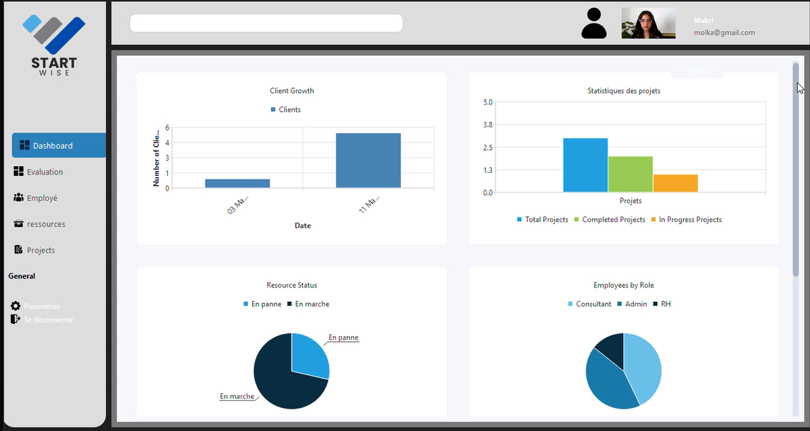
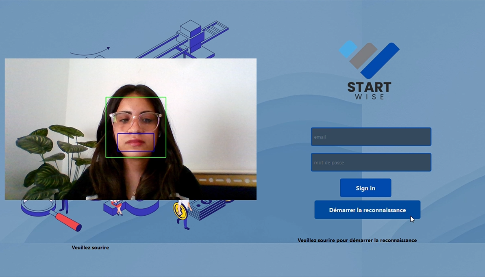
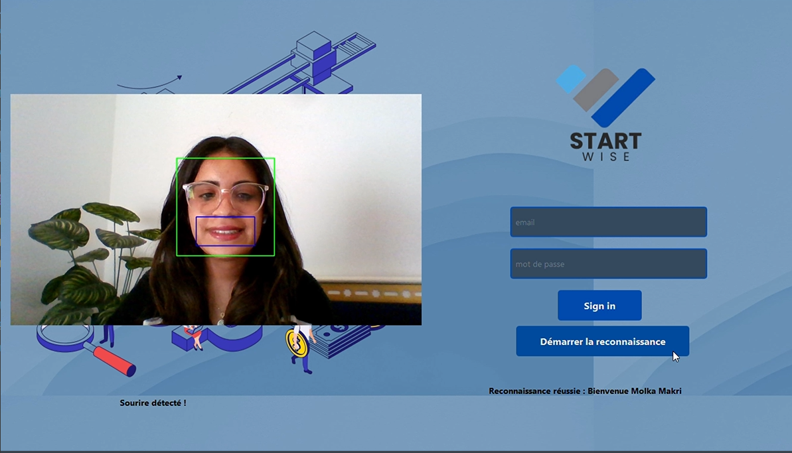
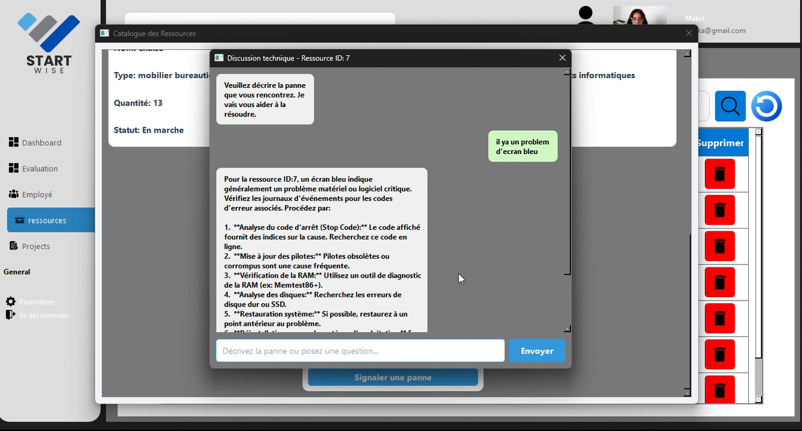
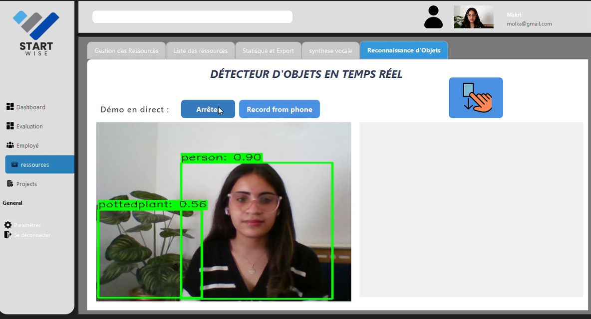
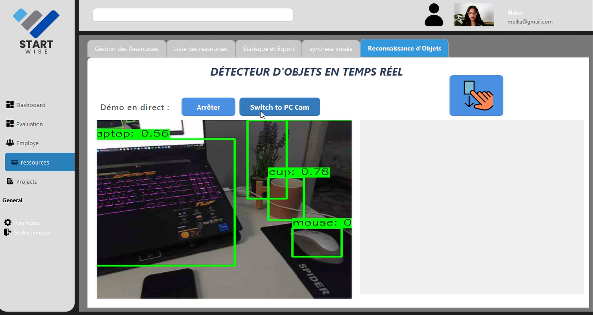
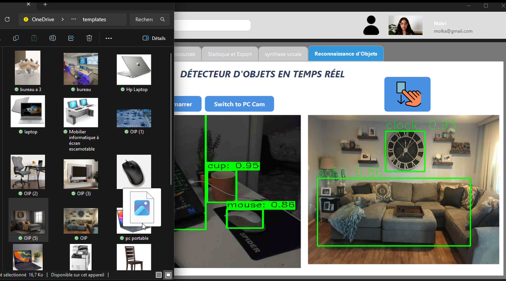

# 🧠 StartWise App – Smart Consulting Desktop Platform

## 🧭 Overview

**StartWise App** is an intelligent desktop platform designed for consulting offices and innovation hubs.  
It integrates AI-driven technologies to enhance project management, team efficiency, client compatibility, and system security.

This all-in-one solution provides advanced features like facial and emotion recognition, real-time resource monitoring, intelligent assistant support, and a dynamic calendar/map system — built with modern UI and intuitive workflows.

---

## 👥 Who Is This Platform For?

<div style="display: flex; flex-wrap: wrap; gap: 20px; justify-content: space-around; margin-top: 20px;">

<div style="flex: 1 1 250px; background: white; border-radius: 10px; padding: 1.5em; box-shadow: 0 4px 8px rgba(0,0,0,0.1);">

### 🏢 Consulting Offices  
Leverage intelligent project-client matching, optimize employee performance with emotion analysis, and streamline office management.

</div>

<div style="flex: 1 1 250px; background: white; border-radius: 10px; padding: 1.5em; box-shadow: 0 4px 8px rgba(0,0,0,0.1);">

### 👩‍💼 Startup Teams  
Secure access with facial recognition, improve task assignment, and ensure timely maintenance of resources through AI assistance.

</div>

<div style="flex: 1 1 250px; background: white; border-radius: 10px; padding: 1.5em; box-shadow: 0 4px 8px rgba(0,0,0,0.1);">

### 📊 Innovation Managers  
Monitor resource health, integrate dynamic calendar and location mapping, and access smart dashboards for decision-making.

</div>

</div>

---

## 💡 Key Features

- 🔐 **Facial Recognition & Emotion Detection** – Secure access and track employee motivation.
- ⚙️ **Fault Detection System** – AI alerts when a device fails ("ressource tombe en panne").
- 🤖 **Integrated AI Assistant** – Provides instant help, guidance, and intelligent suggestions.
- 🧠 **Client-Project Compatibility Engine** – Matches clients to the right projects using smart analysis.
- 📍 **Dynamic Calendar & Map** – Manage events, locations, and deadlines in a smart, interactive view.
- 🔎 **Object Detection** – Enhance task automation and smart interactions with office elements.

---

## 📸 Interface Previews

| Dashboard | Face & emotion Detection |Face & emotion Detection | AI Assistant |
|----------|----------------|----------------------|----------------------|
|  |  |  |  |

| object detection | detection via usb | detection via drag/drop | 
|-------------|----------------|----------------------|
|  | |  |


---

## 🛠️ Installation & Setup

### 1. Clone the Repository

```bash
git clone https://github.com/molka-makri/startwise-app.git
cd startwise-app
